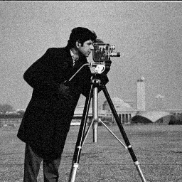

# Denoise based on Haar Coefficients

1. Compile c code: ```./compilegcc DenoiseWithHaarCoefficients``` 
2. Run executable file: ```./DenoiseWithHaarCoefficients```
3. Input the variance of noise: ```100```  (add Gaussien noises) <br>
   Input the number of level: ```3```  <br>
   Input the threshold of gray-level: ```10``` <br>
4. Output 2 image: noised image and denoised image
5. Results <br>



